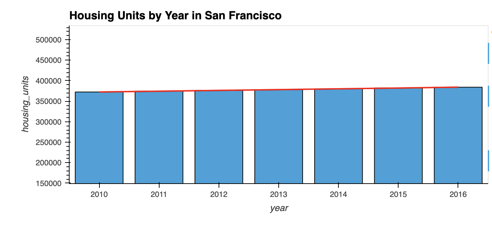
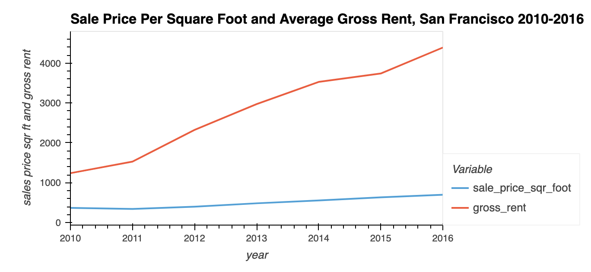
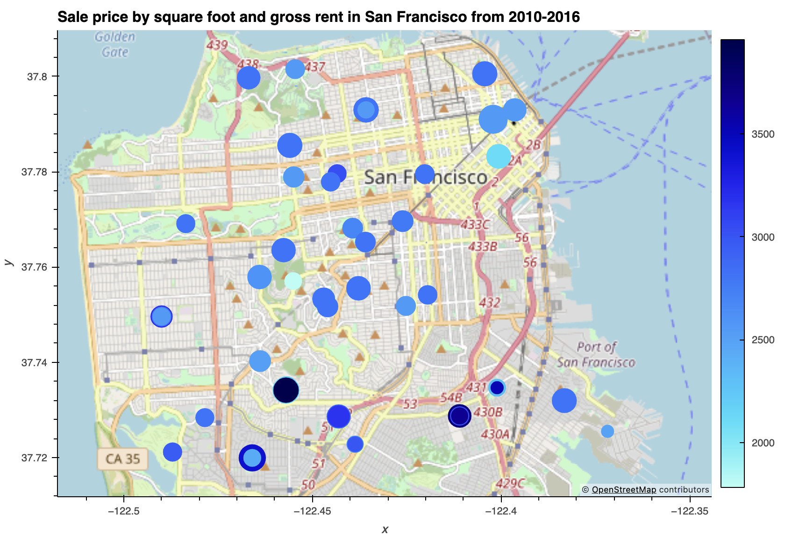

# Housing Rental Analysis for San Francisco(2010-2016)

## Objective

On this project, my objective was to analyze through visualization parts of San Francisco that presents a good option for investments.

## Steps

### Step 1
I calculated and ploted the housing units per year
### Step 2
I calculated and ploted the average sale price per square foot and gross rent by year
### Step 3
I compared the the average sales price by neighborhood
### Step 4
I built an interactive map

## Results
1- Through a graphic I was able to identified that the housing units by year in San Fracisco has been increasing. In 2010, there were 372,560 housing units. And by the last year of our data, 2016, there were 384,242 housing units. 

2- On this part of my analysis I identified by year and the average sale price and gross rent. Through my analysis I was able to identified that through the years, gross rent has been having a more rapidly increased when compared to sale price. Even when I analyzed from 2010 to 2011, where sale price had a decrease of 0.07%. Gross rent had a increase of 0.23%. And when putting both average on a graph we can see the difference between them.

3- On the following part, I analyzed the average sales price by neighborhood. And then I analyzed the Anza Vista neighborhood. I came up with the conclusion that its sale price in 2016 was less when compared to its sale price in 2012. 

4- The last part of my analysis I build an interactive map where I compare gross rent and sale price square foot. 

# Conclusion
My conclusion through my analysis is that gross rent and sale price are to some extend correlated. As more proprities become available to rent, the less properties are for sale which then makes the price to decrease while gross rent goes up.
